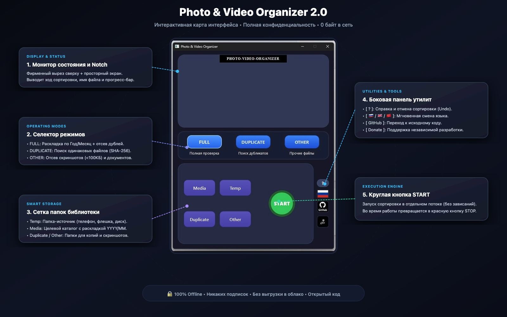

<div align="center">

# 📸 Photo & Video Organizer 2.1
### *Next-Gen Local-First Photo Sorter, Google Takeout Healer & Wi-Fi Phone Drop*

[](https://github.com/keks84725/Photo-Video-Organizer/releases/latest)
[](https://python.org)
[](https://pyside.org)
[]()
[]()
[](LICENSE)

<br/>


<br/>

**[🇷🇺 Описание на русском](#-photo--video-organizer-21) • [🇬🇧 English Guide](#-photo--video-organizer-21-english)**

</div>

---

## 🇷🇺 Photo & Video Organizer 2.1

**Photo & Video Organizer 2.1** — это быстрое, полностью автономное десктопное приложение для наведения идеального порядка в фотоархивах, восстановления архивов Google Takeout и беспроводной передачи медиа с телефона на ПК.

В отличие от облачных сервисов и платных аналогов, программа работает **на 100% локально на вашем компьютере**:
* 🔒 **0 байт отправляется в сеть** — ваши личные фото и документы никогда не покинут ваш ПК или домашний Wi-Fi.
* 💸 **Никаких подписок** — бесплатно, без рекламы и без скрытых платежей.
* ⚡ **Быстрый локальный запуск** — чистый Python-код без скрытых телеметрий и сторонних серверов.

---

### 🔥 Две уникальные суперсилы версии 2.1

#### 1. 🩹 Google Takeout Healer (Лечение архивов Google Фото)
При экспорте архива из Google Takeout даты файлов сбрасываются на дату скачивания архива, а метаданные и GPS-координаты сохраняются отдельно в миллионах файлов `.json`.
* **Автоматическое распознавание связок**: восстанавливает соответствие даже при усечении длинных имен Google (до 47 символов), суффиксах `-edited` и скобках `IMG(1).jpg` ➔ `IMG.jpg(1).json`.
* **Вшивание в EXIF и файловую систему**: извлекает точный `photoTakenTime` и GPS-координаты и записывает их прямо в теги EXIF (`DateTimeOriginal`, `GPSInfo`) и системные даты файла (`os.utime`).
* **Чистый архив**: автоматически удаляет ненужные служебные файлы `.json` после переноса и сортирует снимки в каталоги `Media/Год/Месяц`.

#### 2. 📱 Wi-Fi Phone Drop (Беспроводной AirDrop для ПК)
Прямой перенос фото и видео с iPhone или Android на компьютер по домашнему Wi-Fi без шнуров, облачных дисков и сторонних приложений на телефоне:
* Нажмите кнопку **`📱`** на боковой панели программы.
* Наведите камеру смартфона на показанный QR-код.
* В открывшейся быстрой веб-странице выберите фото и видео из медиатеки телефона и нажмите **Отправить**.
* Файлы потоком передаются напрямую на ПК по локальной сети и сразу загружаются в папку `Temp` для сортировки!

---

### 🗺️ Интерактивная карта интерфейса

Интерфейс спроектирован по принципу *Zero-Friction*: вся функциональность упакована в одно окно размером `585 × 720 px`, где всё понятно с первого взгляда.

<div align="center">



</div>

### 🕹️ Описание блоков и элементов управления

| № | Элемент | Название | Назначение |
|---|---|---|---|
| **1** | **Вырез (Notch)** | `PHOTO-VIDEO-ORGANIZER` | Фирменный статус-бэйдж в стиле Dynamic Island. |
| **2** | **Монитор состояния** | **Экран дисплея** | Выводит ход сканирования, имя обрабатываемого файла, статус дубликатов, отчёт об исцелении Takeout и прогресс-бар в реальном времени. |
| **3** | **Селектор режимов** | `FULL` *(Полная проверка)* | Сортирует фото и видео по папкам `Год/Месяц`, восстанавливает Takeout при наличии json, отсеивает дубликаты в `Duplicates`, а скриншоты — в `Other`. |
| | | `DUPLICATE` *(Поиск дубликатов)* | Сканирует архив и находит одинаковые файлы по криптографическому хэшу SHA-256 без изменения структуры папок. |
| | | `OTHER` *(Прочие файлы)* | Извлекает скриншоты (<100 КБ или по ключевым словам) и документы из фотопотока. |
| | | `TAKEOUT` *(Лечение Takeout)* | Специализированный режим для Google Takeout: вшивает даты и координаты из `.json`, удаляет мусорные метаданные и раскладывает по `YYYY/MM`. |
| **4** | **Сетка папок (2×2)** | `Temp` | **Откуда брать:** папка-источник (фото с телефона, Takeout, флешка фотоаппарата, папка «Загрузки»). |
| | | `Media` | **Куда складывать:** целевая библиотека (автоматически создаются папки `YYYY/MM`). |
| | | `Duplicate` | **Папка дубликатов:** изолированное хранилище найденных копий (файлы не удаляются вслепую). |
| | | `Other` | **Папка прочего:** скриншоты, чеки, нераспознанные форматы. |
| **5** | **Кнопка START** | `START / STOP` | Запуск алгоритма в отдельном потоке (окно не зависает). При клике плавно превращается в красную кнопку `STOP`. |
| **6** | **Боковая панель** | `?` *(Справка & Undo)* | Интерактивная справка и кнопка **«Отменить последнюю сортировку»** (возвращает все файлы обратно, если вы ошиблись). |
| | | `📱` *(Phone Drop)* | Открывает окно быстрого переноса фото и видео с iPhone / Android по QR-коду и домашнему Wi-Fi. |
| | | `🇷🇺 / 🇬🇧 / 🇨🇳` *(Языки)* | Мгновенное переключение языка интерфейса с динамической сменой государственного флага. |
| | | `GitHub` | Прямой переход к странице проекта и обновлениям. |
| | | `Donate` | Кнопка поддержки независимой разработки. |

---

### 💻 Запуск программы

#### Способ 1. Готовая версия для Windows (Без установки Python)
Скачайте готовый автономный файл **`PhotoVideoOrganizer.exe`** на **[странице последнего релиза](https://github.com/keks84725/Photo-Video-Organizer/releases/latest)** (блок *Assets*) и запустите его двойным кликом на Windows 10/11.

#### Способ 2. Запуск из открытого исходного кода (Python)
Приложение кроссплатформенное и работает на Windows, macOS и Linux:

1. Клонируйте репозиторий:
   ```bash
   git clone https://github.com/keks84725/Photo-Video-Organizer.git
   cd Photo-Video-Organizer
   ```
2. Установите зависимости:
   ```bash
   pip install -r requirements.txt
   ```
3. Запустите приложение:
   ```bash
   python main.py
   ```

---

<br/>

## 🇬🇧 Photo & Video Organizer 2.1 (English)

**Photo & Video Organizer 2.1** is an ultra-fast, local-first, privacy-focused desktop application designed to bring order to messy photo archives, restore Google Takeout exports, and wirelessly transfer media from phones to PC.

Unlike cloud solutions or paid subscriptions, this tool operates **100% offline**:
* 🔒 **Zero Telemetry / Zero Cloud** — not a single byte leaves your computer or local Wi-Fi. Your family moments and private photos remain strictly yours.
* 💸 **No Subscriptions** — completely free and open-source under the MIT license.
* ⚡ **Fast Local Execution** — pure open-source code running locally on your hardware.

---

### 🔥 Key Superpowers in Version 2.1

#### 1. 🩹 Google Takeout Healer
Exporting archives from Google Photos via Takeout resets filesystem timestamps to "today" and stores genuine dates and GPS coordinates in millions of `.json` sidecars.
* **Intelligent Sidecar Matcher**: Resolves complex filename mismatches including Google's 47-character truncations, `-edited` versions, and index permutations (`IMG(1).jpg` ➔ `IMG.jpg(1).json`).
* **EXIF & Timestamp Injection**: Parses authentic `photoTakenTime` and GPS coordinates, injecting them directly into image EXIF headers (`DateTimeOriginal`, `GPSInfo`) and updating filesystem timestamps (`os.utime`).
* **Clutter-Free Library**: Automatically deletes orphan `.json` sidecars upon successful move and organizes media neatly into `Media/YYYY/MM`.

#### 2. 📱 Wi-Fi Phone Drop (AirDrop for PC)
Effortlessly transfer photos and videos from iPhone or Android to your PC over your home Wi-Fi with zero cables, zero mobile apps, and zero cloud storage:
* Click the **`📱`** button on the utility sidebar.
* Scan the presented QR code with your smartphone camera.
* Select photos/videos from your mobile camera roll and tap **Send**.
* Files stream directly to your PC in real-time and load right into the `Temp` folder ready for sorting!

---

### 🕹️ Control Panel & Buttons

| No. | Control | Name | Function |
|---|---|---|---|
| **1** | **Top Notch** | `PHOTO-VIDEO-ORGANIZER` | Dynamic island style title badge. |
| **2** | **Display Screen** | **Status Monitor** | Outputs real-time scanning metrics, active filenames, Takeout healing reports, and progress bar. |
| **3** | **Mode Selector** | `FULL` *(Full Check)* | Organizes media chronologically into `YYYY/MM` folders, heals Takeout JSONs, isolates duplicates, and separates screenshots. |
| | | `DUPLICATE` *(Duplicate Check)* | Cryptographic SHA-256 hash scanner that isolates identical clones without modifying the main structure. |
| | | `OTHER` *(Other Check)* | Quickly isolates screenshots (<100KB or filename keywords) and non-photo formats. |
| | | `TAKEOUT` *(Takeout Healer)* | Dedicated Google Takeout pipeline: heals metadata from `.json`, cleans sidecars, and sorts into `YYYY/MM`. |
| **4** | **Folder Grid (2×2)** | `Temp` | **Source:** folder containing unsorted files (phone backups, camera cards, downloads). |
| | | `Media` | **Destination:** target library organized into `YYYY/MM` subfolders. |
| | | `Duplicate` | **Duplicates folder:** safe holding area for detected copies (never deletes files blindly). |
| | | `Other` | **Other folder:** holding area for screenshots and other formats. |
| **5** | **Action Button** | `START / STOP` | Single-click execution running on a background worker thread. Switches to red `STOP` button during operation. |
| **6** | **Utility Sidebar** | `?` *(Help & Undo)* | Interactive documentation modal and one-click **«Undo Last Sort»** button to safely restore all files. |
| | | `📱` *(Phone Drop)* | Opens Wi-Fi Phone Drop modal for instant QR-code wireless file transfer from mobile phones. |
| | | `🇬🇧 / 🇷🇺 / 🇨🇳` *(Languages)* | 3-way language switch with dynamic national flag updates. |
| | | `GitHub` | Direct link to repository and open-source releases. |
| | | `Donate` | Support independent open-source development. |

---

### 📦 Supported Formats

* **Photos**: JPEG, JPG, PNG, HEIC, TIFF, BMP, GIF, WEBP.
* **RAW Formats**: Canon (CR2, CR3), Nikon (NEF, NRW), Sony (ARW, SRF, SR2), Adobe (DNG), Fujifilm (RAF), Panasonic (RW2), Olympus (ORF).
* **Videos**: MP4, MOV, M4V, AVI, MKV, WMV, WEBM, MTS, M2TS, 3GP.
* **Sidecars**: Google Takeout `.json` metadata sidecars.

---

### 💻 How to Run

#### Option 1: Standalone Portable Windows Executable (No Python Required)
Download the pre-compiled **`PhotoVideoOrganizer.exe`** from the **[Latest Release Page](https://github.com/keks84725/Photo-Video-Organizer/releases/latest)** (*Assets* section) and double-click to launch on Windows 10/11.

#### Option 2: Run from Open-Source Python Code
The application is cross-platform and runs on Windows, macOS, and Linux:

1. Clone the repository:
   ```bash
   git clone https://github.com/keks84725/Photo-Video-Organizer.git
   cd Photo-Video-Organizer
   ```
2. Install dependencies:
   ```bash
   pip install -r requirements.txt
   ```
3. Launch the app:
   ```bash
   python main.py
   ```

---

<div align="center">

Made with ❤️ for photographers, archivists, and privacy advocates worldwide.

</div>
