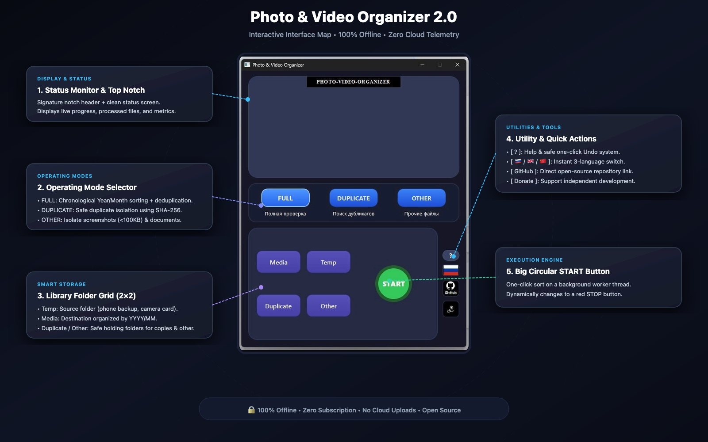

<div align="center">

# 📸 Photo & Video Organizer 2.0
### *Next-Gen Local-First Photo Sorter & Duplicate Cleaner*

[](https://python.org)
[](https://pyside.org)
[]()
[]()
[](LICENSE)

<br/>


<br/>

**[🇷🇺 Описание на русском](#-photo--video-organizer-20) • [🇬🇧 English Guide](#-photo--video-organizer-20-english)**

</div>

---

## 🇷🇺 Photo & Video Organizer 2.0

**Photo & Video Organizer 2.0** — это быстрое, полностью автономное десктопное приложение для наведения идеального порядка в фотоархивах, очистки дубликатов и сортировки снимков по датам.

В отличие от облачных сервисов и платных аналогов, программа работает **на 100% локально на вашем компьютере**:
* 🔒 **0 байт отправляется в сеть** — ваши личные фото и документы никогда не покинут ваш ПК.
* 💸 **Никаких подписок** — бесплатно, без рекламы и без скрытых платежей.
* ⚡ **Быстрый локальный запуск** — чистый Python-код без скрытых телеметрий и облаков.

---

### 🗺️ Интерактивная карта интерфейса

Интерфейс спроектирован по принципу *Zero-Friction*: вся функциональность упакована в одно окно размером `585 × 720 px`, где всё понятно с первого взгляда.

<div align="center">


</div>

### 🕹️ Описание блоков и элементов управления

| № | Элемент | Название | Назначение |
|---|---|---|---|
| **1** | **Вырез (Notch)** | `PHOTO-VIDEO-ORGANIZER` | Фирменный статус-бэйдж в стиле Dynamic Island. |
| **2** | **Монитор состояния** | **Экран дисплея** | Выводит ход сканирования, имя обрабатываемого файла, статус дубликатов и прогресс-бар в реальном времени. |
| **3** | **Селектор режимов** | `FULL` *(Полная проверка)* | Сортирует фотографии по папкам `Год/Месяц` на основе EXIF, отсеивает дубликаты в `Duplicates`, а скриншоты — в `Other`. |
| | | `DUPLICATE` *(Поиск дубликатов)* | Сканирует архив и находит одинаковые файлы по криптографическому хэшу SHA-256 без изменения структуры папок. |
| | | `OTHER` *(Прочие файлы)* | Извлекает скриншоты (<100 КБ или по ключевым словам) и документы из фотопотока. |
| **4** | **Сетка папок (2×2)** | `Temp` | **Откуда брать:** папка-источник (сброшенные фото с телефона, флешки фотоаппарата, папка «Загрузки»). |
| | | `Media` | **Куда складывать:** целевая библиотека (автоматически создаются папки `YYYY/MM`). |
| | | `Duplicate` | **Папка дубликатов:** изолированное хранилище найденных копий (файлы не удаляются вслепую). |
| | | `Other` | **Папка прочего:** скриншоты, чеки, нераспознанные форматы. |
| **5** | **Кнопка START** | `START / STOP` | Запуск алгоритма в отдельном потоке (окно не зависает). При клике плавно превращается в красную кнопку `STOP`. |
| **6** | **Боковая панель** | `?` *(Справка & Undo)* | Интерактивная справка и кнопка **«Отменить последнюю сортировку»** (возвращает все файлы обратно, если вы ошиблись). |
| | | `🇷🇺 / 🇬🇧 / 🇨🇳` *(Языки)* | Мгновенное переключение языка интерфейса с динамической сменой государственного флага. |
| | | `GitHub` | Прямой переход к странице проекта и обновлениям. |
| | | `Donate` | Кнопка поддержки независимой разработки. |

---

### ✨ Возможности версии 2.0

* **Точная датировка по EXIF**: Извлекает метаданные `DateTimeOriginal` даже у старых снимков с профессиональных камер.
* **Поддержка Apple & RAW**: Уверенно читает JPEG, PNG, HEIC, а также форматы фотографов (CR2, CR3, NEF, ARW, DNG, RAF, RW2).
* **Умный фильтр скриншотов**: Автоматически распознает снимки экрана по 15+ языковым паттернам (`screenshot`, `скрин`, `снимок экрана` и т.д.) или объему < 100 КБ.
* **Побайтовое хэширование SHA-256**: Гарантирует, что дубликатом признаются только 100% идентичные файлы, исключая потерю фото.
* **Автосохранение путей**: Запоминает выбранные папки и язык между запусками.
* *(Обработка и умная сортировка видеофайлов запланирована к релизу в версии 2.1)*.

---

### 💻 Запуск программы

Приложение с открытым исходным кодом написано на Python (PySide6) и запускается на Windows, macOS и Linux:

1. Клонируйте репозиторий:
   ```bash
   git clone https://github.com/keks84725/Photo-Video-Organizer.git
   cd Photo-Video-Organizer
   ```
2. Установите зависимости:
   ```bash
   pip install -r requirements.txt
   ```
3. Запустите приложение:
   ```bash
   python main.py
   ```

---

<br/>

## 🇬🇧 Photo & Video Organizer 2.0 (English)

**Photo & Video Organizer 2.0** is an ultra-fast, local-first, privacy-focused desktop application designed to bring order to messy photo archives and clean up duplicates.

Unlike cloud solutions or paid subscriptions, this tool operates **100% offline**:
* 🔒 **Zero Telemetry / Zero Cloud** — not a single byte leaves your computer. Your family moments and private photos remain strictly yours.
* 💸 **No Subscriptions** — completely free and open-source under the MIT license.
* ⚡ **Fast Local Execution** — pure open-source code running locally on your hardware.

---

### 🗺️ Visual Interface Guide

<div align="center">



</div>

### 🕹️ Control Panel & Buttons

| No. | Control | Name | Function |
|---|---|---|---|
| **1** | **Top Notch** | `PHOTO-VIDEO-ORGANIZER` | Dynamic island style title badge. |
| **2** | **Display Screen** | **Status Monitor** | Outputs real-time scanning metrics, active filenames, and progress bar. |
| **3** | **Mode Selector** | `FULL` *(Full Check)* | Organizes photos chronologically into `YYYY/MM` folders, separates duplicates into `Duplicates`, and extracts screenshots into `Other`. |
| | | `DUPLICATE` *(Duplicate Check)* | Cryptographic SHA-256 hash scanner that isolates identical clones without modifying the main structure. |
| | | `OTHER` *(Other Check)* | Quickly isolates screenshots (<100KB or filename keywords) and non-photo formats. |
| **4** | **Folder Grid (2×2)** | `Temp` | **Source:** folder containing unsorted files (phone backups, camera cards, downloads). |
| | | `Media` | **Destination:** target library organized into `YYYY/MM` subfolders. |
| | | `Duplicate` | **Duplicates folder:** safe holding area for detected copies (never deletes files blindly). |
| | | `Other` | **Other folder:** holding area for screenshots and other formats. |
| **5** | **Action Button** | `START / STOP` | Single-click execution running on a background worker thread. Switches to red `STOP` button during operation. |
| **6** | **Utility Sidebar** | `?` *(Help & Undo)* | Interactive documentation modal and one-click **«Undo Last Sort»** button to safely restore all files. |
| | | `🇬🇧 / 🇷🇺 / 🇨🇳` *(Languages)* | 3-way language switch with dynamic national flag updates. |
| | | `GitHub` | Direct link to repository and open-source releases. |
| | | `Donate` | Support independent open-source development. |

---

### 📦 Supported Photo Formats

* **Photos**: JPEG, JPG, PNG, HEIC, TIFF, BMP, GIF, WEBP.
* **RAW Formats**: Canon (CR2, CR3), Nikon (NEF, NRW), Sony (ARW, SRF, SR2), Adobe (DNG), Fujifilm (RAF), Panasonic (RW2), Olympus (ORF).
* *(Advanced video sorting is scheduled for the upcoming v2.1 release)*.

---

### 💻 How to Run

The application is written in open-source Python (PySide6) and runs cross-platform (Windows, macOS, Linux):

1. Clone the repository:
   ```bash
   git clone https://github.com/keks84725/Photo-Video-Organizer.git
   cd Photo-Video-Organizer
   ```
2. Install dependencies:
   ```bash
   pip install -r requirements.txt
   ```
3. Launch the app:
   ```bash
   python main.py
   ```

---

<div align="center">

Made with ❤️ for photographers, archivists, and privacy advocates worldwide.

</div>
